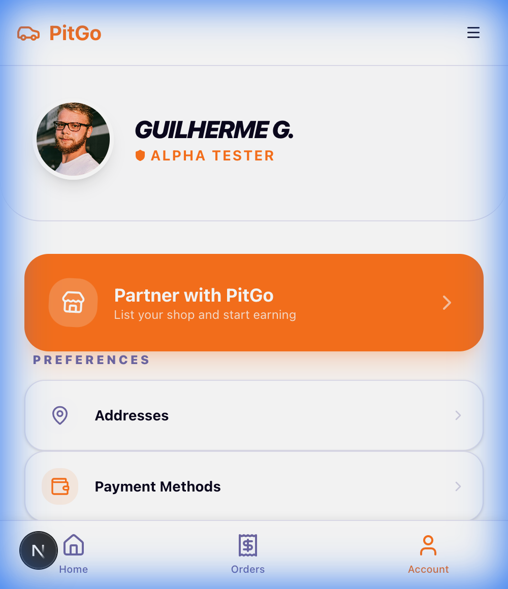
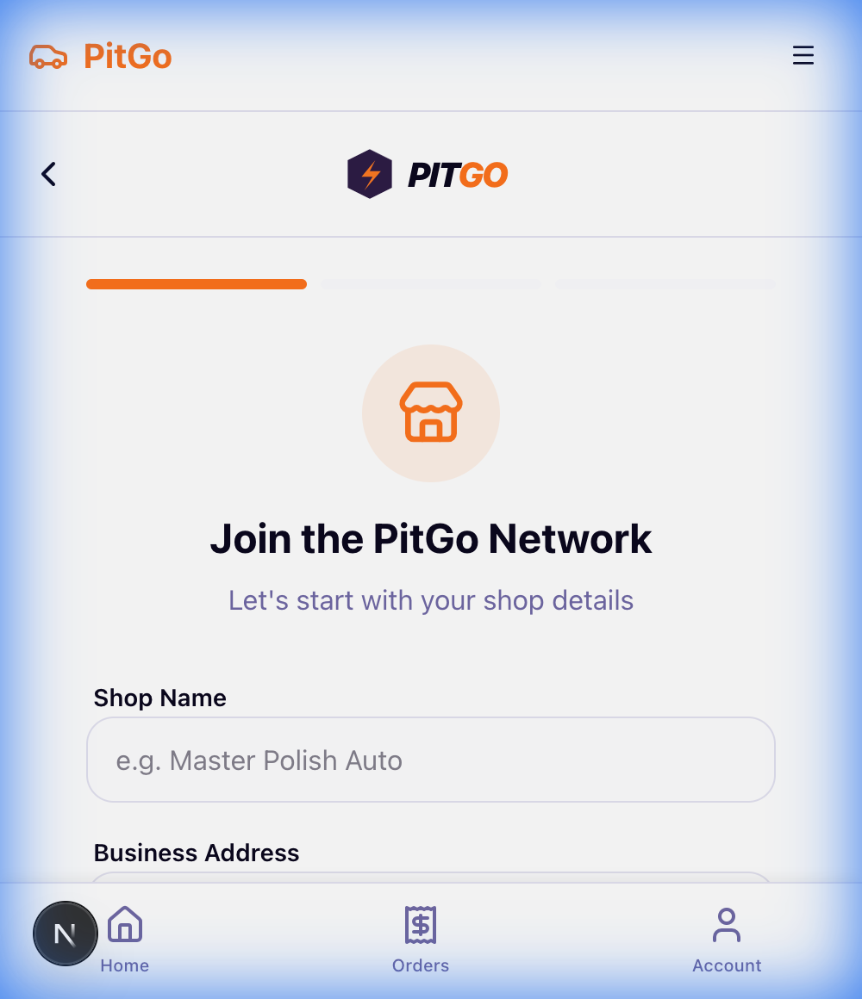
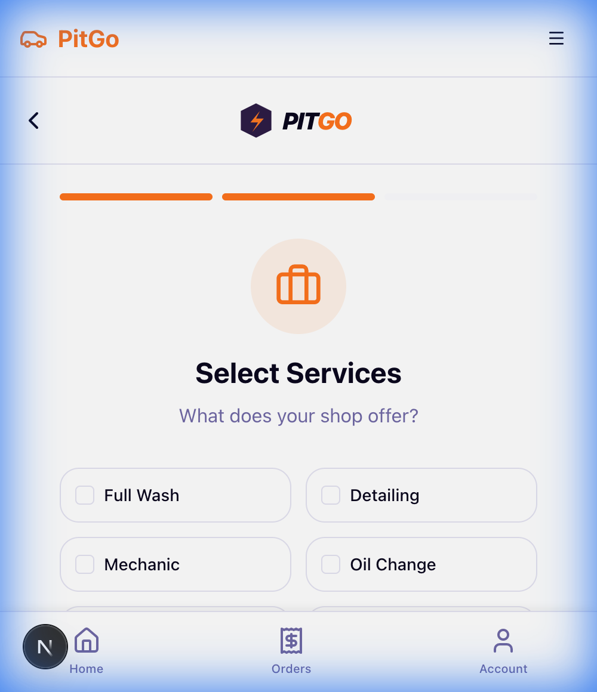
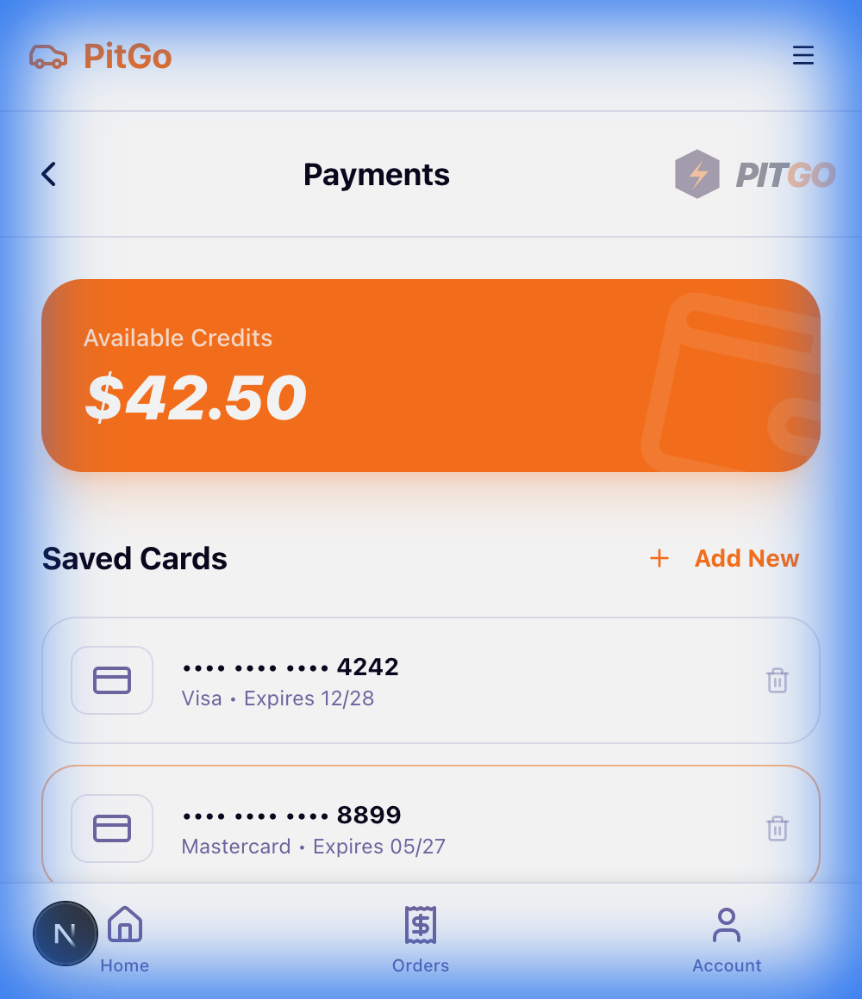

# PitGo Functional Mobile Prototype

The PitGo app is now a fully functional mobile prototype with navigation, service details, and interactive filtering.

## User Flow Walkthrough

### 1. Branded Home & Account
The app now features the official **PitGo Logo** and a personalized Account area with deep links to all management modules.


### 2. Provider Registration Flow
A dedicated multi-step flow for shops to join the network. It covers shop identity, service selection, and portfolio uploads.
````carousel

<!-- slide -->

````

### 3. Payment & Card Management
Users can manage their digital wallet and securely register multiple credit cards for seamless checkouts.


### 5. Production Readiness & PWA
The app is now optimized for the public. It includes:
- **PWA Capabilities**: Users can install PitGo on their iOS/Android home screens.
- **SEO & Social**: Optimized meta tags for search engines and social sharing.
- **Stable Build**: Verified with a clean production build check.

---
## Remote Access (Launch Testing)

To test the application on your physical mobile device:
1.  **Open this link**: [https://huge-hats-exist.loca.lt](https://huge-hats-exist.loca.lt)
2.  If prompted for a **Tunnel Password**, enter: `35.145.23.109`
3.  Click "Click to Submit" to view the functional app.

---
## Technical Implementation
-   **Routing**: Implemented Next.js dynamic routing (`/service/[id]`) for shop details.
-   **State Management**: Used React `useState` for homepage category filtering.
-   **Navigation**: `BottomNav` component is now fully linked to `/`, `/orders`, and `/account`.
-   **Mock Data**: populated pages with realistic static data for demonstration.
